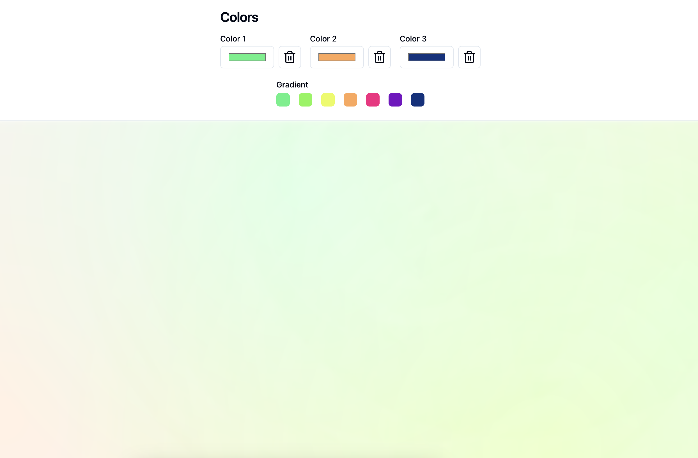

# Gradient Mesh

A React based application to display a Gradient Mesh based on 1-3 colors.

## How it works

1. The system takes between one to three colors as input.
2. Based on those colors, a list of 7 colors is created that will be used for the mesh.
3. The colors are randomly distributed across the display to form a mesh of gradients.

### 7 Colors

The 7 colors are selected using [chroma-js](https://gka.github.io/chroma.js/) and their [scale](https://gka.github.io/chroma.js/#chroma-scale) function. For three colors we form two scales and add them together, before we pick 7 colors. By adding two scales we can get a more interesting mix of colors.

### Gradient Mesh

The Mesh of gradients is achieved via adding multiple `radial-gradient(circle at 75% 30%, #d91df2, transparent 70%)` to the background image of the mesh display. Relevant docs: [gradient](https://developer.mozilla.org/en-US/docs/Web/CSS/gradient/radial-gradient), [gradient sizing](https://developer.mozilla.org/en-US/docs/Web/CSS/gradient/radial-gradient#size), [positioning](https://developer.mozilla.org/en-US/docs/Web/CSS/transform-origin), [background blend mode](https://developer.mozilla.org/en-US/docs/Web/CSS/background-blend-mode).

During dark mode we change the `background-blend-mode` from `color` to `darken` which works better with a dark background.

## Inspiration

Highly inspired by: [CSSHeros Mesher](https://csshero.org/mesher/)
